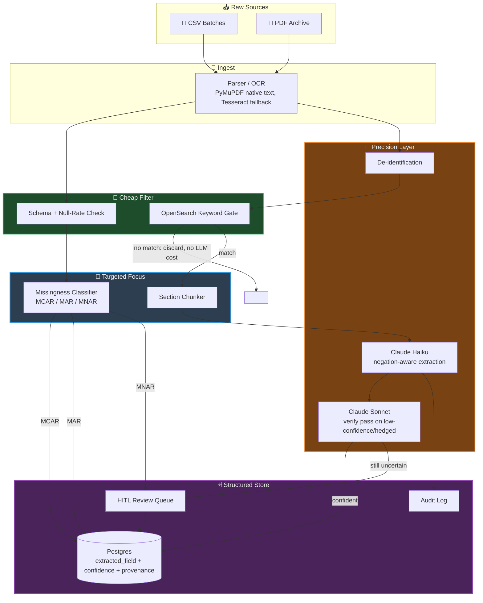

# 🗂️ Extraction Funnel

A working reference implementation of a **progressive extraction funnel** — the
system design pattern for turning millions of messy files (structured CSVs or
unstructured PDFs) into clean, confidence-scored, queryable data without paying
LLM cost on data a cheap filter could have thrown out for free.

The core idea: every stage's job is to shrink the problem before it reaches the
next, more expensive stage. Structured or unstructured, the failure mode is the
same — sending everything through an LLM, or blindly imputing every null. This
repo implements both archetypes end to end against real infrastructure
(Postgres, OpenSearch, Anthropic's Claude), not a slide.

```
Stage 1            Stage 2              Stage 3                Stage 4              Stage 5
INGEST         →   CHEAP FILTER    →    TARGETED FOCUS    →    PRECISION LAYER  →   STRUCTURED STORE
(mechanical)       (deterministic)      (rule/stat-based)      (LLM, narrow set)    (queryable + audited)
```

## 🔀 Two archetypes, one shape

| | CSV / structured (`csv_pipeline/`) | PDF / unstructured (`pdf_pipeline/`) |
|---|---|---|
| Trigger question | "Millions of CSVs, some rows/columns missing — reconcile them." | "Millions of clinical PDFs — find every cancer patient who's a non-smoker." |
| Cheap filter | Schema + null-rate validation | OpenSearch keyword gate (cancer/smoking vocabulary) |
| Targeted focus | Cross-file backfill on entity key | Section chunking (isolate "Social History") |
| Precision layer | — (rules resolve almost everything) | Claude, negation-aware, only on the narrowed chunk |
| Core risk if done naively | Blind imputation silently biases the cohort (MNAR) | Missed negation puts the wrong patient in the cohort |

## 🛠️ Tech Stack

| Layer | Technology |
|---|---|
| LLM | Anthropic Claude — Haiku (extraction) + Sonnet (verify pass) |
| API / orchestration | Python 3.11, FastAPI, asyncio |
| Structured store | PostgreSQL 16, SQLAlchemy 2.0 |
| Cheap-filter search | OpenSearch 2.18 |
| OCR | PyMuPDF (native text) + Tesseract (scanned/image fallback) |
| Data validation | pandas, SciPy (t-test / chi-square for missingness classification) |
| Infra | Docker Compose |
| Testing | pytest, pytest-asyncio |

## 🗺️ Architecture



## 🧱 What's actually implemented (not stubbed)

- **Missingness classification with a statistical basis, not a guess.** `csv_pipeline/missingness_classifier.py`
  runs a t-test/chi-square check to decide whether a null is MCAR, MAR (explained
  by another observed column), or MNAR — then only imputes the MCAR case,
  cross-file-backfills the MAR case, and routes MNAR straight to human review.
  It also encodes a **domain prior**: MNAR is, by definition, missingness that
  depends on an *unobserved* variable — which means it is statistically
  indistinguishable from MCAR when you only look at the data you have. Fields
  with a known clinical MNAR pattern (e.g. `smoking_status` blank because a
  template skips it for non-smokers) are flagged from domain knowledge, because
  the stats alone can't do it. (`tests/test_missingness_classifier.py` proves both
  paths, including the case where the naive statistical test gets it wrong.)
- **Schema drift detection with fuzzy column matching**, not a silent drop —
  a renamed column (`diagnosis_code` → `diagnosis_cd`) is caught and merged into
  a new schema version instead of losing data.
- **Golden-record dedup with edit-distance fuzzy matching**, tuned to actually
  work on short entity IDs — an early version of this repo used similarity-ratio
  matching (`difflib`) and it silently collapsed 80 distinct patients into 9,
  because ratio-based matching over short strings with shared prefixes produces
  false positives almost everywhere. Switched to edit distance ≤ 1, which only
  catches genuine single-character typos.
- **Negation-aware extraction with a real verify pass.** The Claude Haiku prompt
  in `pdf_pipeline/extractor.py` explicitly handles negation ("denies smoking"),
  subject attribution ("father smoked" ≠ patient smoked), and current-vs-historical
  status. Anything low-confidence or hedged gets a second, context-richer pass on
  Sonnet before it's trusted.
- **A cheap filter that actually discards documents before any LLM call** —
  the OpenSearch keyword gate in `pdf_pipeline/lexical_filter.py` is queried and
  verified to reject the irrelevant sample document with zero LLM spend.
- **OCR fallback that's actually exercised** — one sample PDF has no text layer
  at all (rendered from an image), forcing the Tesseract path in `pdf_pipeline/ocr.py`
  instead of the native-text path everything else takes.
- **A live HITL review queue** (`review_ui/`) — a small FastAPI app that lists
  every low-confidence/MNAR-flagged field and lets a reviewer accept, correct, or
  reject it.
- **Per-file transactional isolation** — the PDF pipeline processes each file in
  its own DB transaction. An early version shared one transaction across the whole
  batch, so one bad file (a missing OCR dependency, a malformed LLM response)
  silently rolled back every already-successful extraction in the run.
- **LLM observability, not just an audit trail.** Every call in `common/llm.py`
  captures latency, input/output token counts, and an estimated cost, and
  `common/audit.py` writes them onto the `audit_log` row alongside the prompt and
  response. `scripts/llm_cost_report.py` aggregates that by model — on a real run
  of the 6 sample PDFs this reports 5 Haiku calls + 1 Sonnet verify pass, ~1.2K
  input / ~280 output tokens, ~1.6s avg latency, **$0.0047 total cost**. This is
  the minimum telemetry needed to answer "did the last prompt change get slower
  or more expensive" without grepping logs.

## 📊 Verified results (real run against this repo's sample data)

CSV pipeline, 3 files / 80 entities / 460 raw field observations:
```
[classify] ehr_export_batch1.csv.smoking_status: MNAR suspected -> flagging 31 rows for HITL, never auto-filled
[classify] ehr_export_batch1.csv.diagnosis_code: MAR (explained by 'age') -> backfill
[schema] ehr_export_batch2.csv: fuzzy-matched renamed columns {'diagnosis_cd': 'diagnosis_code'}

[dedup] 460 raw field rows merged into 80 golden entities

--- Data Quality Report ---
          direct:   409  (88.9%)
    human_review:    35  (7.6%)
         imputed:    11  (2.4%)
      backfilled:     5  (1.1%)
```

PDF pipeline, 6 clinical notes:
```
[ingest] patient_0001.pdf: 1 page(s), OCR confidence 1.00, 0 PHI field(s) redacted
[precision] patient_0001.pdf: smoking_status='non_smoker' confidence=0.99 -> stored
[filter] patient_0003.pdf: no trigger terms found -> discarded before any LLM call
[precision] patient_0004.pdf: smoking_status='non_smoker' confidence=1.00 -> stored   # family history correctly excluded
[precision] patient_0005.pdf: smoking_status='unknown' confidence=1.00 -> stored      # genuinely ambiguous chart, correctly refuses to guess
[ingest] patient_0006.pdf: 1 page(s), OCR confidence 0.95, 0 PHI field(s) redacted     # image-only PDF, Tesseract fallback path

--- Cohort Query: cancer_diagnosis=true AND smoking_status=non_smoker ---
  patient_0001  (confidence=0.990)
  patient_0004  (confidence=1.000)
  patient_0006  (confidence=0.990)
```
1 of 6 documents (`patient_0003`) never reached the LLM at all — the entire point
of the cheap filter stage.

## 🎯 Evaluating extraction quality (not just unit tests)

`tests/` mocks every LLM call — that verifies the *wiring* (verify-pass triggers,
confidence gating, HITL routing), not whether the *prompt* is any good.
`scripts/evaluate_extraction.py` is the separate answer to that: it runs the real
Claude extractor against a small hand-labeled gold set and reports precision/recall
per class, gated at 80% accuracy so it can fail a CI run if a prompt edit regresses
quality.

```
file               smoking: expected -> predicted         cancer_dx: exp -> pred   match
patient_0001.pdf   non_smoker -> non_smoker               true -> true             OK
patient_0002.pdf   smoker -> smoker                       true -> true             OK
patient_0004.pdf   non_smoker -> non_smoker               true -> true             OK
patient_0005.pdf   unknown -> unknown                     true -> true             OK
patient_0006.pdf   non_smoker -> non_smoker               true -> true             OK

smoking_status accuracy: 100.0% (5/5)
  smoker       precision=1.00  recall=1.00
  non_smoker   precision=1.00  recall=1.00
  unknown      precision=1.00  recall=1.00
```

Five labeled examples is a floor, not a claim of statistical rigor — the honest
framing is "this is the harness," not "this is a validated model." In production
this gold set grows from every HITL correction the review queue produces, not
from hand-curation.

## 🚀 Running it

Requires Docker and an [Anthropic API key](https://console.anthropic.com/).

```bash
cp .env.example .env        # add your ANTHROPIC_API_KEY
docker compose up -d postgres opensearch
docker compose build app

# CSV archetype
docker compose run --rm app python -m csv_pipeline.pipeline sample_data/csv

# PDF archetype (needs a real Claude API key)
docker compose run --rm app python -m pdf_pipeline.pipeline sample_data/pdf

# HITL review queue
docker compose up app        # http://localhost:8080

# LLM cost/latency report
docker compose run --rm app python -m scripts.llm_cost_report

# Extraction quality gold-set eval (real Claude calls)
docker compose run --rm -e ANTHROPIC_API_KEY app python -m scripts.evaluate_extraction
```

Regenerate the synthetic sample data (deterministic, seeded):
```bash
pip install -r scripts/requirements-dev.txt
python scripts/generate_csv_data.py
python scripts/generate_pdf_data.py
```

Run the test suite (no infra required — the LLM is mocked):
```bash
pip install -r requirements.txt
pytest tests/ -v
```

## 💰 Cost model

The cheap filter is the whole cost story. On this sample set, the lexical gate
discarded 1 of 6 PDFs (~17%) before any LLM call; at real document volumes,
keyword/schema filters typically discard 85–95% of files before precision-layer
cost is incurred at all. Every LLM call in this repo runs against a single
narrowed chunk (a few hundred tokens), not a raw document — that's the
difference between "5% of files reach the LLM" and "100% of files reach the LLM."
Every call's actual cost is measured, not estimated after the fact — see
`scripts/llm_cost_report.py` and the observability bullet above.

## 📂 Repo layout

```
common/           SQLAlchemy models (file_registry, extracted_field, hitl_review,
                   audit_log), DB session, Anthropic client wrapper
csv_pipeline/      schema registry, validator, missingness classifier, backfill,
                   dedup, orchestrator
pdf_pipeline/      OCR (native + Tesseract fallback), de-identification, lexical
                   filter, section chunker, negation-aware extractor, orchestrator
review_ui/         FastAPI HITL review queue
sample_data/       synthetic CSVs (MCAR/MAR/MNAR/schema-drift/dedup fixtures) and
                   synthetic clinical-note PDFs (negation/subject-attribution/
                   hedge-language/OCR-fallback fixtures)
scripts/           sample-data generators, plus llm_cost_report.py (observability)
                   and evaluate_extraction.py (gold-set precision/recall eval)
tests/             unit tests; LLM calls are mocked, no live API key needed
```

## 🚧 What this deliberately doesn't do

This is a portfolio-scale reference implementation, not a production system.
It doesn't handle: multi-tenant isolation, streaming ingest (S3 events / Kafka),
horizontal worker scaling, a real NER-based de-identification model (the demo
uses regex — swap for AWS Comprehend Medical or an in-house model), or a
proper schema-registry service (a JSON file stands in for Glue Data Catalog).
The interfaces are shaped so any of those are a swap-in, not a rewrite.

`scripts/evaluate_extraction.py` is also a hand-rolled harness, not a formal
LLM evaluation framework — it has no faithfulness/groundedness scoring, no
LLM-as-judge cross-check, and no run-over-run trend tracking. A production
version of this would sit on Ragas or TruLens (or LangSmith/Braintrust for the
tracing side) rather than a custom precision/recall script. The gap is
deliberate for a portfolio-scope repo, but it's the first thing that should
change before this extraction logic touched a real cohort.
