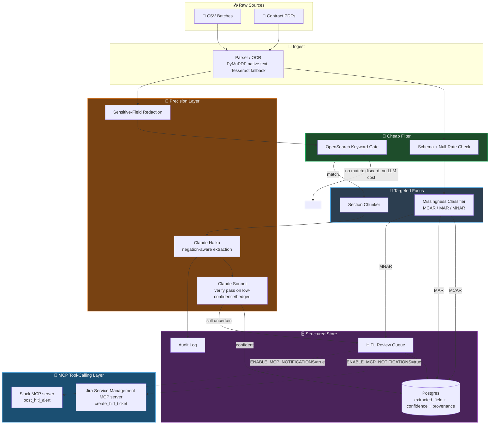

# 🗂️ Extraction Funnel

A working reference implementation of a **progressive extraction funnel** — the
system design pattern for turning millions of messy files (structured CSVs or
unstructured PDFs) into clean, confidence-scored, queryable data without paying
LLM cost on data a cheap filter could have thrown out for free.

The core idea: every stage's job is to shrink the problem before it reaches the
next, more expensive stage. Structured or unstructured, the failure mode is the
same — sending everything through an LLM, or blindly imputing every null. This
repo implements both archetypes end to end against real infrastructure
(Postgres, OpenSearch, Anthropic's Claude), not a slide.

```
Stage 1            Stage 2              Stage 3                Stage 4              Stage 5
INGEST         →   CHEAP FILTER    →    TARGETED FOCUS    →    PRECISION LAYER  →   STRUCTURED STORE
(mechanical)       (deterministic)      (rule/stat-based)      (LLM, narrow set)    (queryable + audited)
```

## 🔀 Two archetypes, one shape

| | CSV / structured (`csv_pipeline/`) | PDF / unstructured (`pdf_pipeline/`) |
|---|---|---|
| Trigger question | "Millions of vendor CSVs, some rows/columns missing — reconcile them." | "Millions of vendor contracts — find every one with an indemnification clause and no cap on liability." |
| Cheap filter | Schema + null-rate validation | OpenSearch keyword gate (liability/indemnification vocabulary) |
| Targeted focus | Cross-file backfill on entity key | Section chunking (isolate "Limitation of Liability") |
| Precision layer | — (rules resolve almost everything) | Claude, negation-aware, only on the narrowed chunk |
| Core risk if done naively | Blind imputation silently biases the vendor risk picture (MNAR) | Missed negation clears a contract that's actually high-risk |

## 🛠️ Tech Stack

| Layer | Technology |
|---|---|
| LLM | Anthropic Claude — Haiku (extraction) + Sonnet (verify pass) |
| API / orchestration | Python 3.11, FastAPI, asyncio |
| Structured store | PostgreSQL 16, SQLAlchemy 2.0 |
| Cheap-filter search | OpenSearch 2.18 |
| OCR | PyMuPDF (native text) + Tesseract (scanned/image fallback) |
| Data validation | pandas, SciPy (t-test / chi-square for missingness classification) |
| HITL tool-calling | MCP (`mcp` SDK) — Jira Service Management + Slack servers, stdio transport |
| Infra | Docker Compose |
| Testing | pytest, pytest-asyncio |

## 🗺️ Architecture



## 🧱 What's actually implemented (not stubbed)

- **Missingness classification with a statistical basis, not a guess.** `csv_pipeline/missingness_classifier.py`
  runs a t-test/chi-square check to decide whether a null is MCAR, MAR (explained
  by another observed column), or MNAR — then only imputes the MCAR case,
  cross-file-backfills the MAR case, and routes MNAR straight to human review.
  It also encodes a **domain prior**: MNAR is, by definition, missingness that
  depends on an *unobserved* variable — which means it is statistically
  indistinguishable from MCAR when you only look at the data you have. Fields
  with a known MNAR pattern (e.g. `compliance_flag` blank because a procurement
  template only fills it in when there's something to report) are flagged from
  domain knowledge, because the stats alone can't do it. (`tests/test_missingness_classifier.py`
  proves both paths, including the case where the naive statistical test gets it wrong.)
- **A guard against high-cardinality columns faking a MAR signal.** The first
  real run of this pipeline against the vendor data misclassified `region_code`
  (genuinely random dropout) as explained by `registration_number` — a
  near-unique-per-row identifier where every "category" is 1-2 rows, so its
  null-rate trivially looks like 0% or 100% by chance. Fixed by excluding
  identifier-like columns (>50% unique values) from the explaining-column search;
  `tests/test_missingness_classifier.py::test_high_cardinality_identifier_column_does_not_spuriously_explain_missingness`
  locks this in.
- **Schema drift detection with fuzzy column matching**, not a silent drop —
  a renamed column (`registration_number` → `registration_no`) is caught and
  merged into a new schema version instead of losing data.
- **Golden-record dedup with edit-distance fuzzy matching**, tuned to actually
  work on short entity IDs — an early version of this repo used similarity-ratio
  matching (`difflib`) and it silently collapsed 80 distinct vendors into 9,
  because ratio-based matching over short strings with shared prefixes produces
  false positives almost everywhere. Switched to edit distance ≤ 1, which only
  catches genuine single-character typos.
- **Negation-aware extraction with a real verify pass.** The Claude Haiku prompt
  in `pdf_pipeline/extractor.py` explicitly handles negation ("liability shall
  not be limited"), subject attribution (a subcontractor's liability cap ≠ the
  vendor's own), and deferred/hedged terms ("subject to further negotiation").
  Anything low-confidence or hedged gets a second, context-richer pass on Sonnet
  before it's trusted.
- **A cheap filter that actually discards documents before any LLM call** —
  the OpenSearch keyword gate in `pdf_pipeline/lexical_filter.py` is queried and
  verified to reject an irrelevant sample document (an equipment rental order
  form with no liability language) with zero LLM spend. An earlier version
  space-joined multi-word trigger terms into one OR'd query string, which
  silently leaked common words (e.g. "of" from "limitation of liability") into
  the match and let the irrelevant document through by accident — fixed by
  matching each trigger term as an exact phrase.
- **OCR fallback that's actually exercised** — one sample PDF has no text layer
  at all (rendered from an image), forcing the Tesseract path in `pdf_pipeline/ocr.py`
  instead of the native-text path everything else takes.
- **A live HITL review queue** (`review_ui/`) — a small FastAPI app that lists
  every low-confidence/MNAR-flagged field and lets a reviewer accept, correct, or
  reject it.
- **Real MCP servers wired into the HITL boundary** (`integrations/`) — a Jira
  Service Management server (`create_hitl_ticket`) and a Slack server
  (`post_hitl_alert`), each a genuine stdio MCP server built on the official
  `mcp` SDK, called through a real `ClientSession`/`stdio_client` connection,
  not a mocked interface. Fires the moment a field lands in the HITL queue —
  MNAR-flagged CSV rows and low-confidence/negation-ambiguous PDF fields alike
  — so a reviewer finds out from Slack/Jira instead of polling `review_ui/`.
  Off by default (`ENABLE_MCP_NOTIFICATIONS=false`) and a failed tool call is
  logged and swallowed, never fails the extraction run — see
  [🔌 HITL Notifications via MCP](#-hitl-notifications-via-mcp) below.
- **Per-file transactional isolation** — the PDF pipeline processes each file in
  its own DB transaction. An early version shared one transaction across the whole
  batch, so one bad file (a missing OCR dependency, a malformed LLM response)
  silently rolled back every already-successful extraction in the run.
- **LLM observability, not just an audit trail.** Every call in `common/llm.py`
  captures latency, input/output token counts, and an estimated cost, and
  `common/audit.py` writes them onto the `audit_log` row alongside the prompt and
  response. `scripts/llm_cost_report.py` aggregates that by model — on a real run
  of the 6 sample contracts this reports 5 Haiku calls + 1 Sonnet verify pass,
  ~1.4K input / ~350 output tokens, **$0.0079 total cost**. This is the minimum
  telemetry needed to answer "did the last prompt change get slower or more
  expensive" without grepping logs.

## 📊 Verified results (real run against this repo's sample data)

CSV pipeline, 3 files / 80 entities / 460 raw field observations:
```
[classify] procurement_export_batch1.csv.compliance_flag: MNAR suspected -> flagging 32 rows for HITL, never auto-filled
[classify] procurement_export_batch1.csv.registration_number: MAR (explained by 'employee_count') -> backfill
[schema] procurement_export_batch2.csv: fuzzy-matched renamed columns {'registration_no': 'registration_number'}

[dedup] 460 raw field rows merged into 80 golden entities

--- Data Quality Report ---
          direct:   406  (88.3%)
    human_review:    38  (8.3%)
         imputed:    13  (2.8%)
      backfilled:     3  (0.7%)
```

PDF pipeline, 6 vendor contracts:
```
[ingest] contract_0001.pdf: 1 page(s), OCR confidence 1.00, 0 sensitive field(s) redacted
[precision] contract_0001.pdf: liability_cap_status='uncapped' confidence=0.95 -> stored
[filter] contract_0003.pdf: no trigger terms found -> discarded before any LLM call
[precision] contract_0004.pdf: liability_cap_status='uncapped' confidence=0.95 -> stored   # subcontractor's cap correctly excluded
[precision] contract_0005.pdf: liability_cap_status='unknown' confidence=0.95 -> stored    # genuinely deferred terms, correctly refuses to guess
[ingest] contract_0006.pdf: 1 page(s), OCR confidence 0.95, 0 sensitive field(s) redacted   # image-only PDF, Tesseract fallback path

--- Risk Review Query: indemnification_present=true AND liability_cap_status=uncapped ---
  contract_0001  (confidence=0.950)
  contract_0004  (confidence=0.950)
  contract_0006  (confidence=0.950)
```
1 of 6 documents (`contract_0003`, a plain equipment rental order with no legal
boilerplate) never reached the LLM at all — the entire point of the cheap
filter stage.

## 🎯 Evaluating extraction quality (not just unit tests)

`tests/` mocks every LLM call — that verifies the *wiring* (verify-pass triggers,
confidence gating, HITL routing), not whether the *prompt* is any good.
`scripts/evaluate_extraction.py` is the separate answer to that: it runs the real
Claude extractor against a small hand-labeled gold set and reports precision/recall
per class, gated at 80% accuracy so it can fail a CI run if a prompt edit regresses
quality.

```
file                 liability: expected -> predicted       indemnification: exp -> pred   match
contract_0001.pdf    uncapped -> uncapped                   true -> true                   OK
contract_0002.pdf    capped -> capped                       true -> true                   OK
contract_0004.pdf    uncapped -> uncapped                   true -> true                   OK
contract_0005.pdf    unknown -> unknown                     true -> true                   OK
contract_0006.pdf    uncapped -> uncapped                   true -> true                   OK

liability_cap_status accuracy: 100.0% (5/5)
  capped       precision=1.00  recall=1.00
  uncapped     precision=1.00  recall=1.00
  unknown      precision=1.00  recall=1.00
```

Five labeled examples is a floor, not a claim of statistical rigor — the honest
framing is "this is the harness," not "this is a validated model." In production
this gold set grows from every HITL correction the review queue produces, not
from hand-curation.

## 🚀 Running it

Requires Docker and an [Anthropic API key](https://console.anthropic.com/).

```bash
cp .env.example .env        # add your ANTHROPIC_API_KEY
docker compose up -d postgres opensearch
docker compose build app

# CSV archetype
docker compose run --rm app python -m csv_pipeline.pipeline sample_data/csv

# PDF archetype (needs a real Claude API key)
docker compose run --rm app python -m pdf_pipeline.pipeline sample_data/pdf

# HITL review queue
docker compose up app        # http://localhost:8080

# LLM cost/latency report
docker compose run --rm app python -m scripts.llm_cost_report

# Extraction quality gold-set eval (real Claude calls)
docker compose run --rm -e ANTHROPIC_API_KEY app python -m scripts.evaluate_extraction
```

Regenerate the synthetic sample data (deterministic, seeded):
```bash
pip install -r scripts/requirements-dev.txt
python scripts/generate_csv_data.py
python scripts/generate_pdf_data.py
```

Run the test suite (no infra required — the LLM is mocked):
```bash
pip install -r requirements.txt
pytest tests/ -v
```

## 🔌 HITL Notifications via MCP

Every HITL trigger in this repo — an MNAR-flagged CSV field, a low-confidence
or negation-ambiguous PDF field — is also a tool-calling opportunity: instead
of a reviewer polling `review_ui/`, the pipeline can call out through MCP the
moment the field lands in the queue.

`integrations/jira_server.py` and `integrations/slack_server.py` are real
stdio MCP servers built on the official `mcp` SDK (`FastMCP`), each wrapping
one real API (Jira Cloud REST v3, Slack's `chat.postMessage`) behind a single
tool (`create_hitl_ticket`, `post_hitl_alert`). `integrations/notifier.py` is
the client side: `HitlNotifier` opens one `ClientSession` per server per
pipeline run (not a subprocess per event) and calls both tools whenever a
`HitlEvent` fires from `csv_pipeline/pipeline.py` or `pdf_pipeline/pipeline.py`.

This is deliberately the same shape as an agent's tool-calling loop — a
caller decides to invoke a named MCP tool with structured arguments and gets
a structured result back — just triggered by a deterministic confidence/MNAR
gate instead of an LLM's tool-choice decision.

```bash
# Enable it (needs real credentials -- see .env.example for the full list)
ENABLE_MCP_NOTIFICATIONS=true
JIRA_BASE_URL=https://your-domain.atlassian.net
JIRA_EMAIL=you@example.com
JIRA_API_TOKEN=...
JIRA_PROJECT_KEY=EXTR
SLACK_BOT_TOKEN=xoxb-...
SLACK_CHANNEL=#extraction-funnel-hitl

# Run a server standalone (e.g. to attach it to Claude Desktop or another MCP host)
python -m integrations.jira_server
python -m integrations.slack_server
```

Off by default (`ENABLE_MCP_NOTIFICATIONS=false`) so the pipeline runs end to
end on Docker Compose without any Jira/Slack account — the same "swap-in, not
a rewrite" posture as the redaction and schema-registry stand-ins below. A
failed or unconfigured tool call is logged and swallowed
(`integrations/notifier.py::HitlNotifier._call_tool`) — a notification
outage must never fail the extraction run itself. Salesforce Agentforce IT
Service was evaluated as a third target but skipped: this repo's HITL queue
is a vendor/procurement risk workflow, not an IT service desk, so it wasn't
a natural fit the way Jira Service Management and Slack are.

## 💰 Cost model

The cheap filter is the whole cost story. On this sample set, the lexical gate
discarded 1 of 6 contracts (~17%) before any LLM call; at real document volumes,
keyword/schema filters typically discard 85–95% of files before precision-layer
cost is incurred at all. Every LLM call in this repo runs against a single
narrowed chunk (a few hundred tokens), not a raw document — that's the
difference between "5% of files reach the LLM" and "100% of files reach the LLM."
Every call's actual cost is measured, not estimated after the fact — see
`scripts/llm_cost_report.py` and the observability bullet above.

## 📂 Repo layout

```
common/           SQLAlchemy models (file_registry, extracted_field, hitl_review,
                   audit_log), DB session, Anthropic client wrapper
csv_pipeline/      schema registry, validator, missingness classifier, backfill,
                   dedup, orchestrator
pdf_pipeline/      OCR (native + Tesseract fallback), sensitive-field redaction,
                   lexical filter, section chunker, negation-aware extractor,
                   orchestrator
integrations/      Jira Service Management + Slack MCP servers (jira_server.py,
                   slack_server.py) and the MCP client wiring (notifier.py) that
                   calls them from the HITL boundary in both pipelines
review_ui/         FastAPI HITL review queue
sample_data/       synthetic vendor/procurement CSVs (MCAR/MAR/MNAR/schema-drift/
                   dedup fixtures) and synthetic vendor-contract PDFs (negation/
                   subject-attribution/hedge-language/OCR-fallback fixtures)
scripts/           sample-data generators, plus llm_cost_report.py (observability)
                   and evaluate_extraction.py (gold-set precision/recall eval)
tests/             unit tests; LLM calls are mocked, no live API key needed
```

## 🚧 What this deliberately doesn't do

This is a portfolio-scale reference implementation, not a production system.
It doesn't handle: multi-tenant isolation, streaming ingest (S3 events / Kafka),
horizontal worker scaling, a real NER-based redaction model (the demo uses regex
— swap for AWS Comprehend or an in-house DLP model), or a proper schema-registry
service (a JSON file stands in for Glue Data Catalog). The interfaces are shaped
so any of those are a swap-in, not a rewrite.

`scripts/evaluate_extraction.py` is also a hand-rolled harness, not a formal
LLM evaluation framework — it has no faithfulness/groundedness scoring, no
LLM-as-judge cross-check, and no run-over-run trend tracking. A production
version of this would sit on Ragas or TruLens (or LangSmith/Braintrust for the
tracing side) rather than a custom precision/recall script. The gap is
deliberate for a portfolio-scope repo, but it's the first thing that should
change before this extraction logic touched a real contract portfolio.
